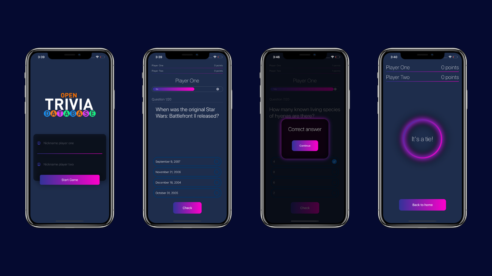

# OpenTrivia
> Simple Trivia game for iOS for 2 players developed in SwiftUI

## Requirements

- iOS 13.1+
- Xcode 11.1+

## Technologies

The app does not use any third party libraries. Developed using native frameworks:
- SwiftUI
- Combine
Everything is native, including animations like the one in the loading screen or the timer.
